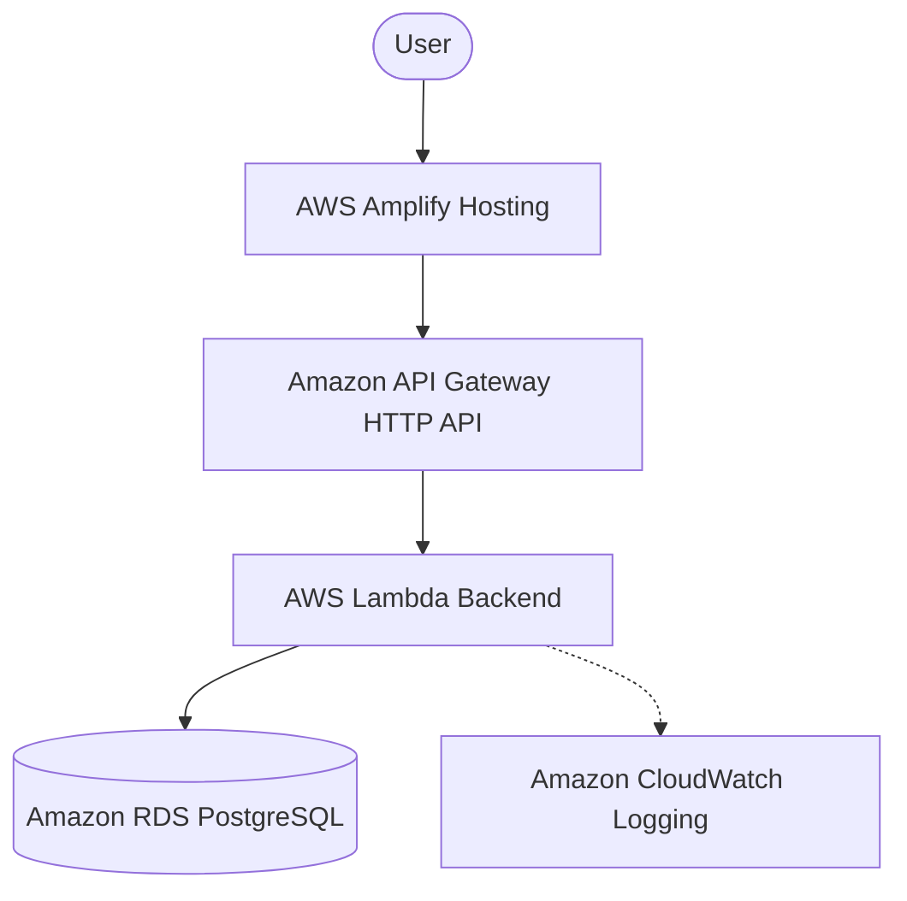

# Poolsy

A cloud-native expense splitting application built for groups.

## Demo

https://www.youtube.com/watch?v=o085ML43GZo

## Problem

Splitting expenses with friends, roommates, or other groups usually means spreadsheets, manual math, and confusion about who owes whom. It gets harder still when some expenses are paid from a shared pool of money and others are paid directly by individual members — most tools aren't built to track both at once.

## Solution

Poolsy is a group expense app built around two ideas: **shared expenses** and **common pools**. It tracks contributions, external expenses, pool payments, member balances, transaction history, and settlements in one place, using an explicit accounting model so that member balances and the actual pool balance always stay consistent and auditable.

## Features

- User registration and login
- Group creation
- Group members and invites
- Contributions
- External expenses
- Pool payments
- Recent activity feed
- Transaction history
- Balance and summary views
- Settlement workflow
- Exact decimal financial calculations (no floating-point rounding errors)
- Mobile-first responsive design, tested on real devices (demo video shown on desktop for clarity)

## How It Works

Poolsy keeps two things in sync: each member's **Net Balance** and the actual **Pool Balance**.

- **Contributions** (money deposited into the pool): increase the Pool Balance and increase the contributing member's Net Balance.
- **External expenses** (paid out-of-pocket): increase the paying member's Net Balance and decrease each participating member's Net Balance by their share. These do **not** affect the Pool Balance.
- **Pool payments** (paid from the pool): decrease the Pool Balance and decrease each participating member's Net Balance by their share.
- **Settlement deposits** (money paid into the pool to clear a member's negative balance): increase the Pool Balance and the depositing member's Net Balance.
- **Settlement payouts** (money paid out of the pool to clear a member's positive balance): decrease the Pool Balance and the receiving member's Net Balance.

### Core Accounting Model

```
Member Net =
    Deposited to Pool
  + Paid Externally
  - Share of Expenses
  + Settlement Deposits
  - Settlement Payouts

Pool Balance =
    Contributions
  + Settlement Deposits
  - Settlement Payouts
  - Pool Payments
```

> Note: External expenses never touch the Pool Balance — only who owes whom. Pool Payments always draw from the shared pool, so they reduce the Pool Balance directly. Settlement deposits/payouts are tracked separately from regular contributions/expenses to keep a clean audit trail.

## Architecture

Poolsy runs on a serverless AWS stack, chosen to keep infrastructure costs near zero when idle and to avoid managing servers during a hackathon build.



**AWS services used:**
- AWS Amplify — frontend hosting & CI/CD
- Amazon API Gateway — HTTP API layer
- AWS Lambda — backend compute
- Amazon RDS for PostgreSQL — persistent storage
- Amazon CloudWatch — logging & monitoring

## Tech Stack

**Frontend:** React, Vite

**Backend:** Python, Flask, Mangum, Gunicorn

**Database:** PostgreSQL (SQLite for local development)

**Authentication:** JWT, bcrypt

## Local Development

### Backend

```bash
cd backend
python -m venv venv
# Windows: venv\Scripts\activate
# Mac/Linux: source venv/bin/activate
pip install -r requirements.txt
python init_db.py
python app.py
```

### Frontend

```bash
cd frontend
npm install
npm run dev
```

## Production Deployment

1. **Frontend** — the Vite React app is deployed via AWS Amplify Hosting.
2. **Backend** — the Flask app is wrapped with `Mangum` to convert between the WSGI interface and AWS Lambda's event format, invoked through an Amazon API Gateway HTTP API.
3. **Database** — a production Amazon RDS PostgreSQL instance is the source of truth, connected securely to the Lambda function.

## Project Structure

```text
.
├── backend/
│   ├── app.py              # Main Flask application & accounting logic
│   ├── models.py           # SQLAlchemy database models
│   ├── init_db.py          # Local database initialization
│   └── requirements.txt    # Python dependencies
├── frontend/
│   ├── index.html          # Vite entry point
│   ├── src/
│   │   ├── App.jsx         # Main React application & routing
│   │   ├── api.js          # API Gateway fetch wrapper
│   │   ├── index.css       # Styling
│   │   └── main.jsx        # React DOM entry
│   └── package.json        # Node dependencies
├── build_lambda.ps1        # PowerShell script to package the Lambda zip
└── amplify.yml              # AWS Amplify CI/CD configuration
```

## Hackathon

Built for the AWS / WeMakeDevs **First Commit** hackathon, Ship It track.
